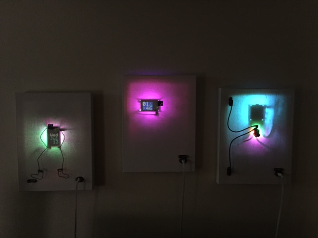

# CompuCanvas

Raspberry Pi systems in wall-hanging art canvas enclosures.

##### CompuCanvas systems

* Model A0 [details](model/A0), [construction](model/A0/construction), [parts](doc/parts/A-series)
* Model S2A [details](model/S2A)
* Model S2B ("Boots") [details](model/S2B)
* Model RB3x [details](model/RB3x)
* Model RB3y [details](model/RB3y)
* Model SKTn1 ("SkeletonKingThing") [details](model/SKTn1)

See the [CompuCanvas-code](https://github.com/cjdaly/CompuCanvas-code) repo for notes on how to control CompuCanvas features from the Linux command line and how to setup a new CompuCanvas (starting from new Raspbian Jessie install).
