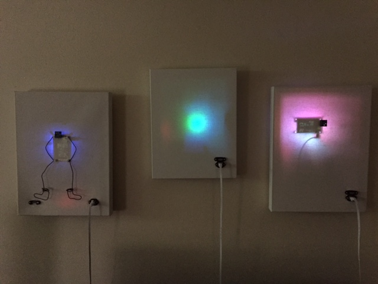

# CompuCanvas

Raspberry Pi systems in wall-hanging art canvas enclosures.

##### CompuCanvas systems

* Model A0 [details](model/A0), [construction](model/A0/construction), [parts](doc/parts/A-series)
* Model S2A [details](model/S2A)

See the [CompuCanvas-code](https://github.com/cjdaly/CompuCanvas-code) repo
for details on how to use CompuCanvas features and how to setup new CompuCanvas
(starting from Raspbian Jessie install).
