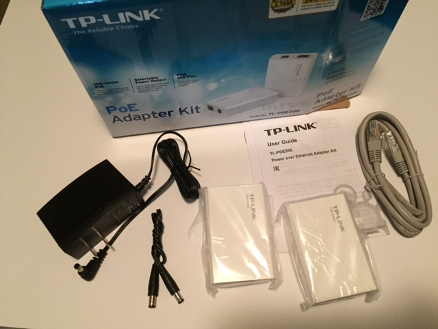
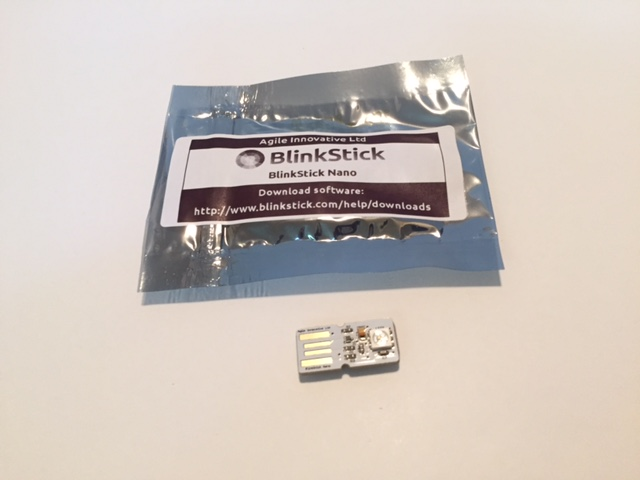
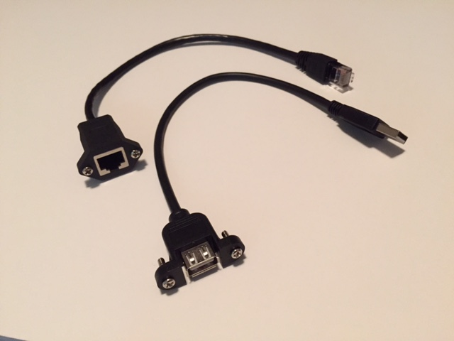
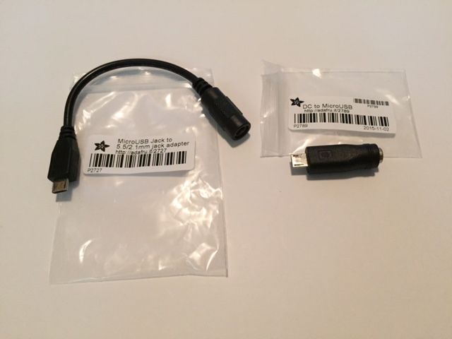
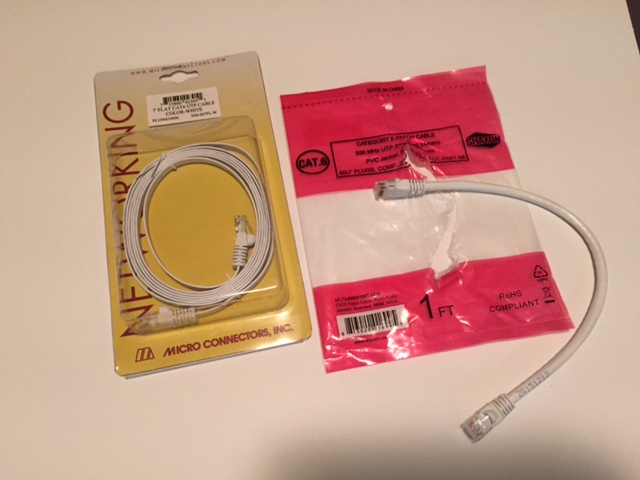

## A-series parts

Beginning with the pièce de résistance,

The hardware shown below will be used to mount the rPi.

These #4-40 from Pololu fit through the rPi mounting holes:

* [standoffs](https://www.pololu.com/product/1949)
* [screws](https://www.pololu.com/product/1961)
* [hex nuts](https://www.pololu.com/product/1068)

The rPi and other components will be set behind this canvas,

### components

The [blinkstick nano](https://www.blinkstick.com/products/blinkstick-nano) plugs directly into a USB port and has an RGB LED on each side.

### cables

These [USB](https://www.adafruit.com/products/908) and [Ethernet](https://www.adafruit.com/products/909) panel mount cables from Adafruit are the interface between the front of the canvas and the parts inside.

Also from Adafruit, one of these barrel jack to USB power [adapters](https://www.adafruit.com/products/2789) or short [cables](https://www.adafruit.com/products/2727) is used to send the incoming power from the POE unit to the rPi.

The longer ethernet cable below is used outside the canvas and the short one is used inside.

