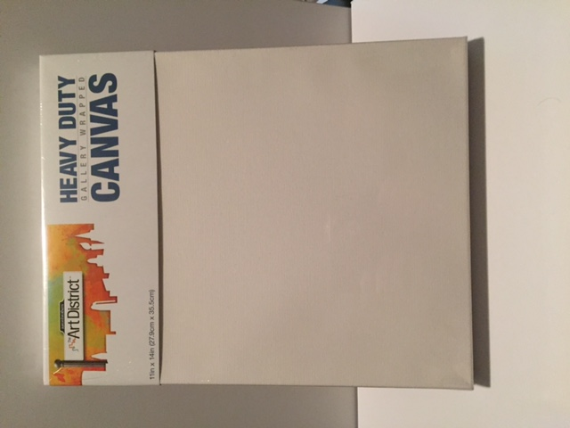
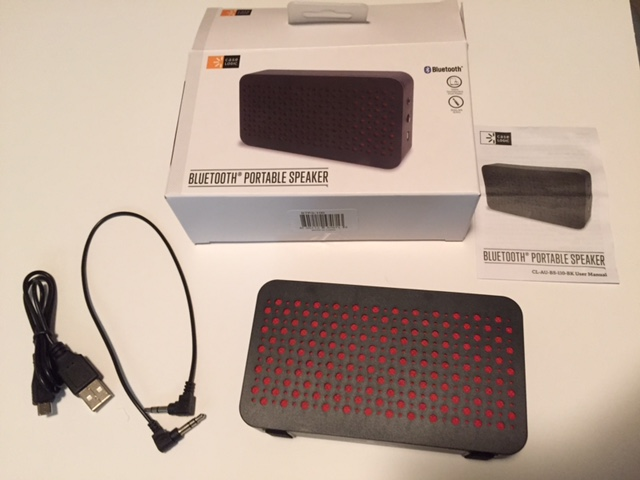

## A-series parts

Beginning with the pièce de résistance,

The hardware shown below will be used to mount the rPi.

These #4-40 from Pololu fit through the rPi mounting holes:

* [standoffs](https://www.pololu.com/product/1949)
* [screws](https://www.pololu.com/product/1961)
* [hex nuts](https://www.pololu.com/product/1068)

The rPi and other components will be set behind this canvas,

### components

### cables

