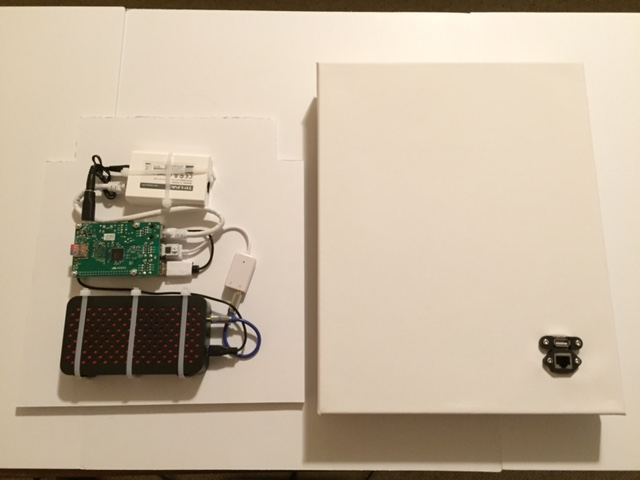
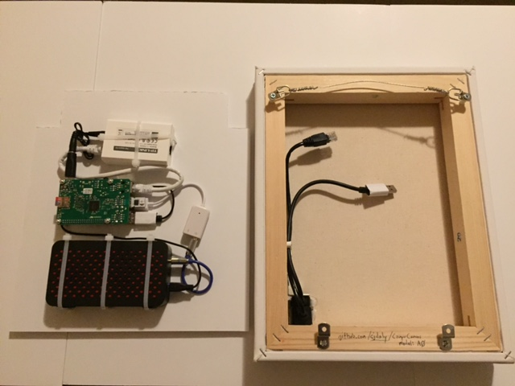

## CompuCanvas model A0

#### tech specs

* Raspberry Pi 2 (4 cores, 32-bit ARM, 1GB RAM)
* speaker system
* power over Ethernet unit
* BlinkStick nano

See the [parts](../../doc/parts/A-series) and [construction](construction) pages for more details

