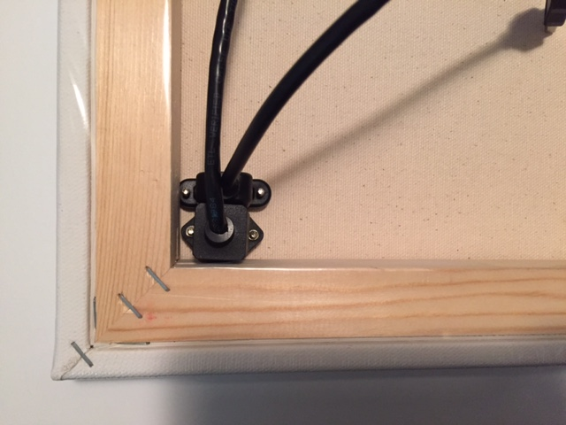

## CompuCanvas model A0 construction

Start by aligning the cables inside the canvas frame and trace around the reachable edges.  It's better to take the screws out of the cables before doing this.

Shown below are 3 tools I use a lot to cut through the canvas (and also the foam board used below).

Here is the front of the canvas after initial cutting.  I cut flaps like shown, narrow at first and then widen a little if needed.

Getting the screws through the canvas can be a giant pain ... especially on the side not shown here!

I use several parts from the hardware store to control the cables.

The angle bracket should be screwed in close to the cables so it will hold them firmly in place.

While doing the initial canvas work, I leave the plastic wrap over most of it but cut away some to avoid small pieces of plastic getting stuck around the cable screws.

These are parts from a picture framing shop for wall hanging and holding foam board backing in place.

The Raspberry Pi, speaker and POE unit will be attached to this piece of foam board which will sit behind the canvas.

But first, need to cut away some excess so it fits.

Now this enclosure is ready for the rPi and other electronic parts.

