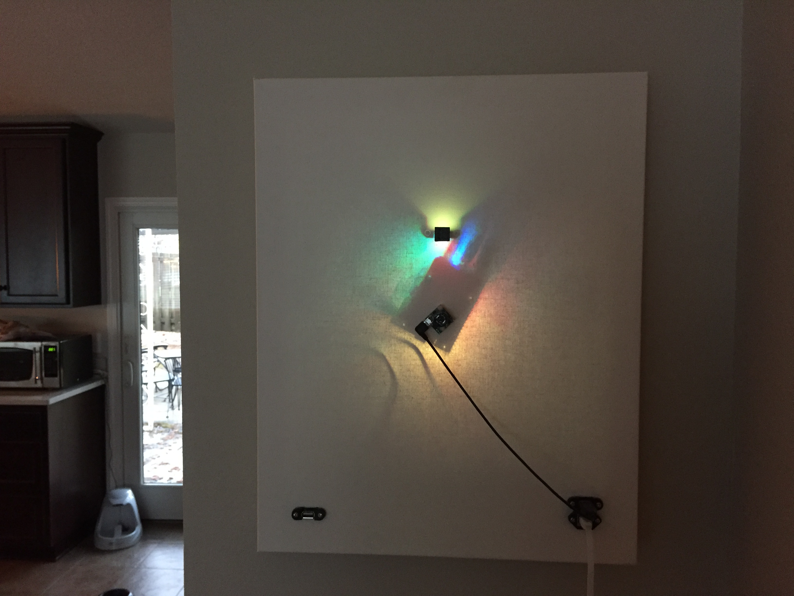
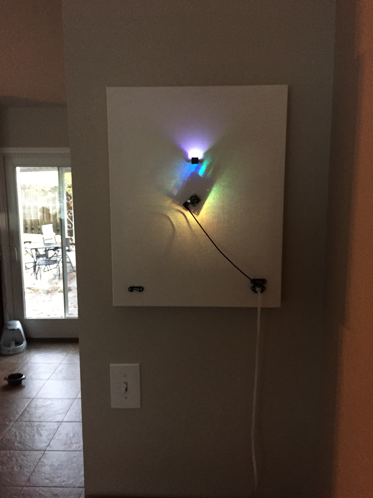
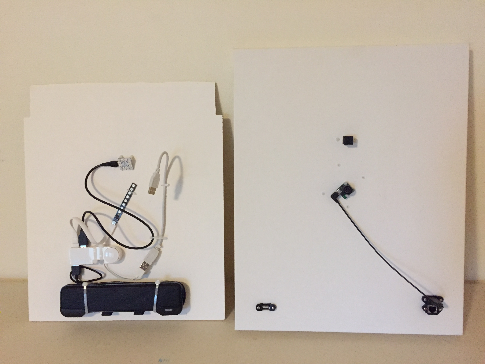
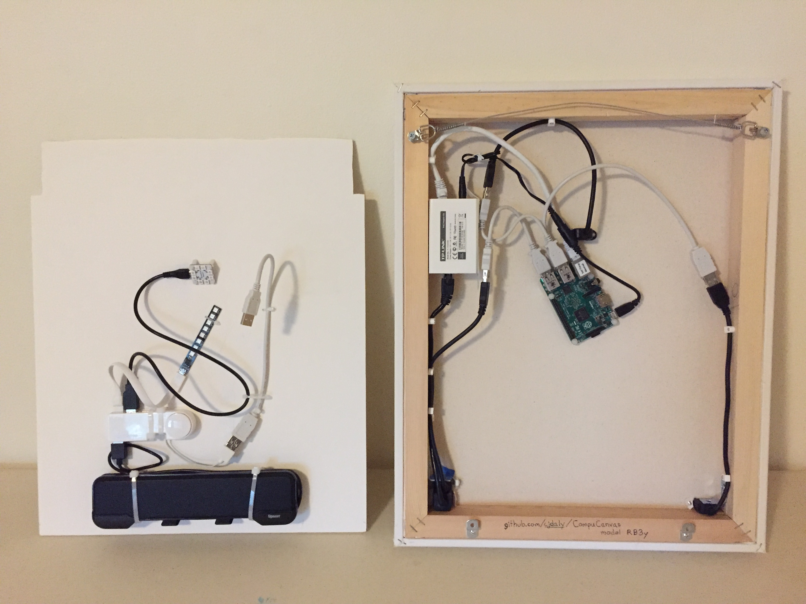

## CompuCanvas model RB3y

#### tech specs

* Raspberry Pi 2 (4 cores, 64-bit ARM, 1GB RAM)
* USB speaker system
* Power over Ethernet unit
* Maxbotix Ultrasonic Rangefinder
* BlinkStick Square, Strip and Nano

