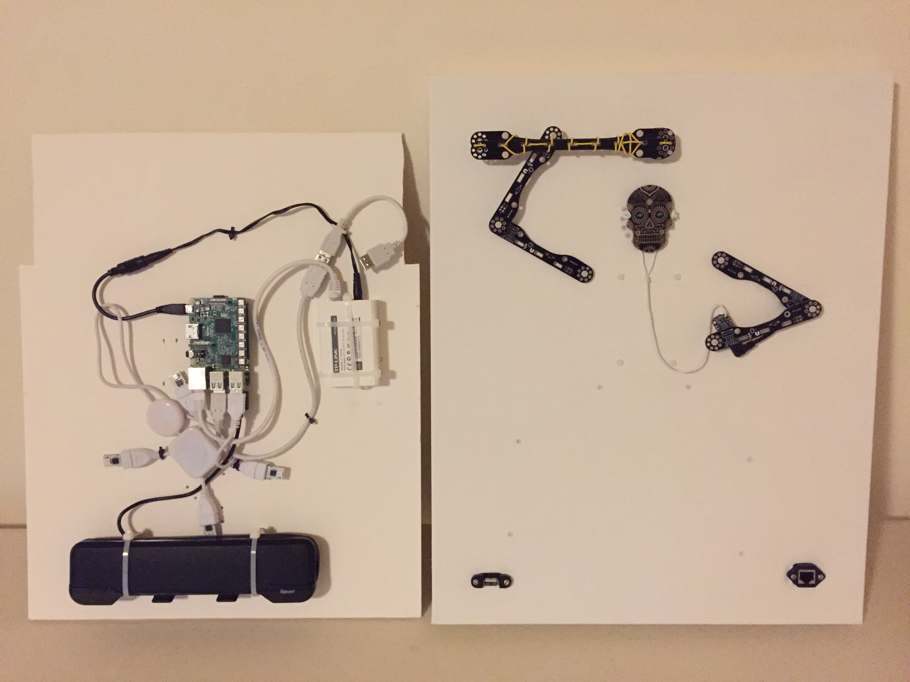
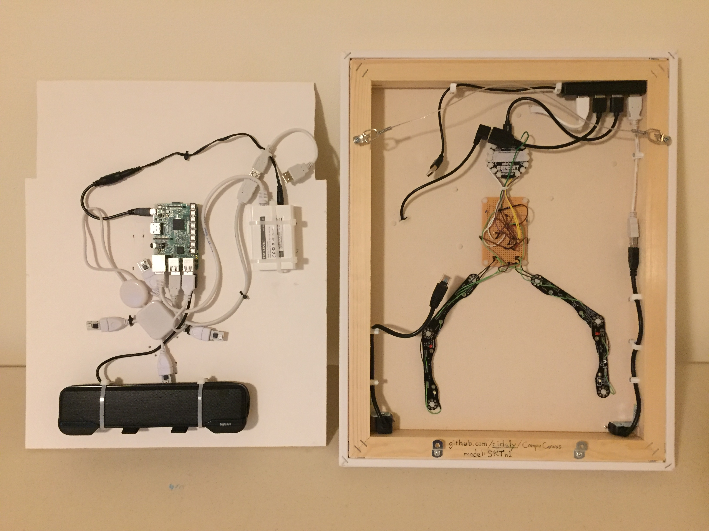

## CompuCanvas model SKTn1 - Skeleton King Thing

#### tech specs

* Raspberry Pi 3 (4 cores, 64-bit ARM, 1GB RAM)
* speaker system and USB audio driver
* Power over Ethernet unit
* 3 Adafruit CircuitPython devices
* 4 BlinkStick Nanos
* Pimoroni Blinkt

