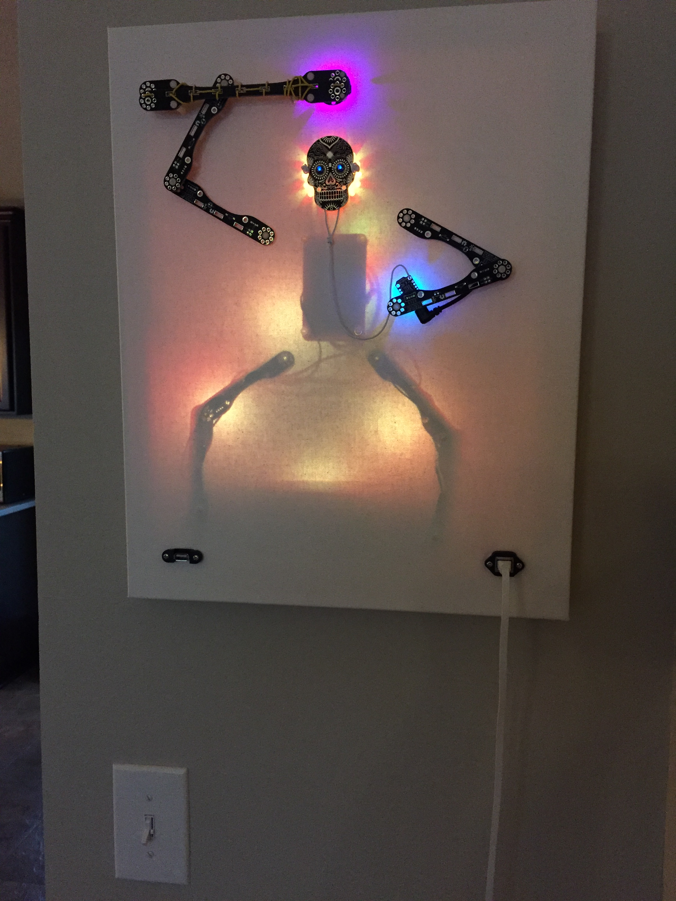

## CompuCanvas model SKTn1 - Skeleton King Thing

When I saw the [Day of the Geek badge](https://www.adafruit.com/product/3590) on Adafruit, I knew I had to build another CompuCanvas.  Just in time for Halloween 2017 comes the Skeleton King Thing!  Equipped with a war bone and a smart phone, he straddles the thin line between our world and the netherworld behind the canvas.

#### tech specs

* Raspberry Pi 3 (4 cores, 64-bit ARM, 1GB RAM)
* speaker system and USB audio driver
* Power over Ethernet unit
* 3 Adafruit CircuitPython devices
  * [GemmaM0](https://www.adafruit.com/product/3501) on the war bone
  * [TrinketM0](https://www.adafruit.com/product/3500) for the smart phone
  * [Circuit Playground Express](https://www.adafruit.com/product/3333) for the king's crown
* 4 BlinkStick Nanos behind the canvas (legs)
* Pimoroni [Blinkt](https://www.adafruit.com/product/3195) behind the canvas (torso)

