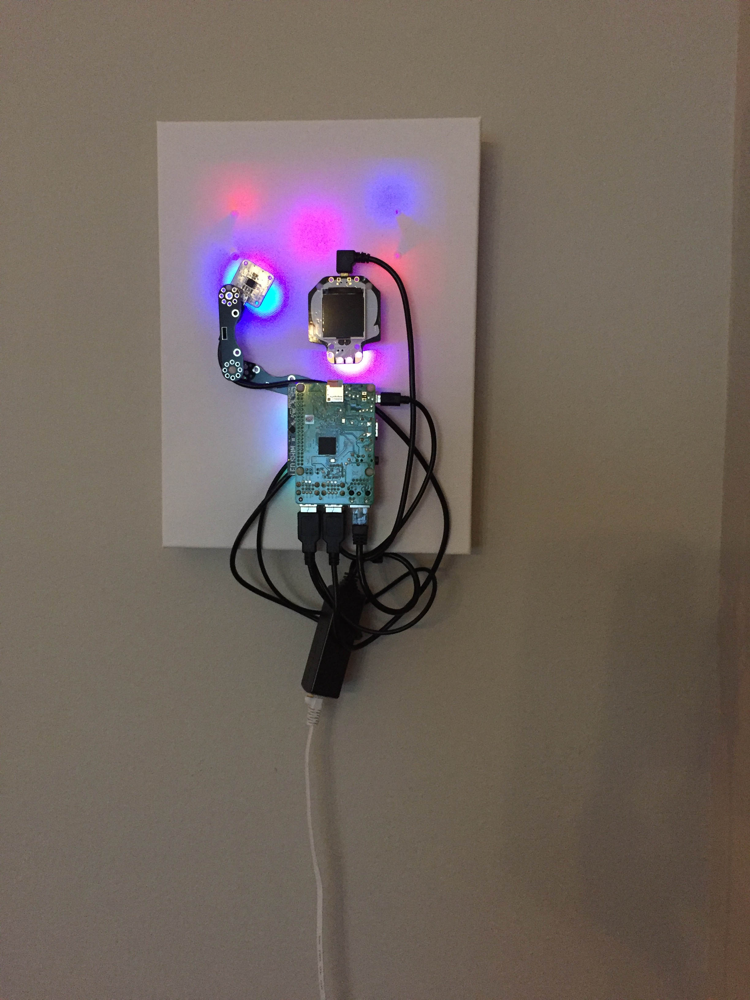
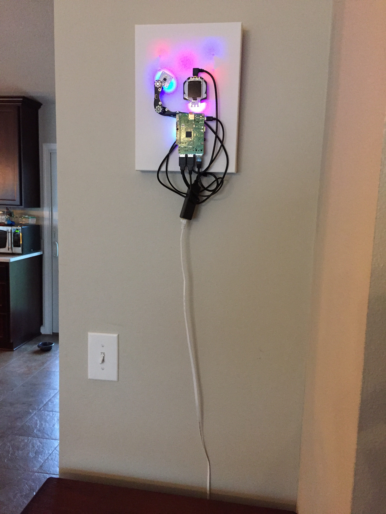

## CompuCanvas model SKTn2

#### tech specs

* Raspberry Pi 3B+
* PoE injector: TRENDnet TPE-113GI; splitter: [Adafruit 3785](https://www.adafruit.com/product/3785)
* BlinkStick [Square](https://www.blinkstick.com/products/blinkstick-square)
* Pimoroni [LED shim](https://shop.pimoroni.com/products/led-shim)
* Adafruit [HalloWing](https://www.adafruit.com/product/3900)
* Adafruit [NeoTrellis](https://www.adafruit.com/product/3938) (behind canvas)
* mini USB speaker: [Adafruit 3369](https://www.adafruit.com/product/3369)

