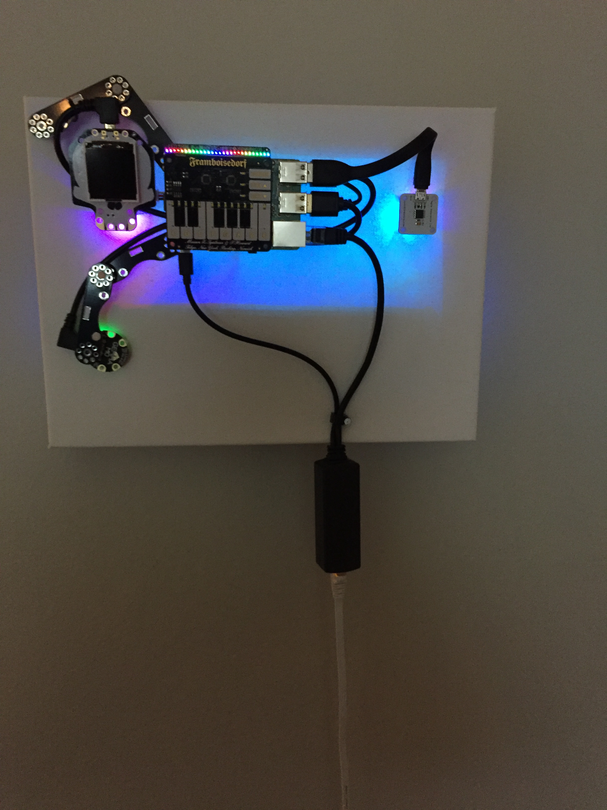
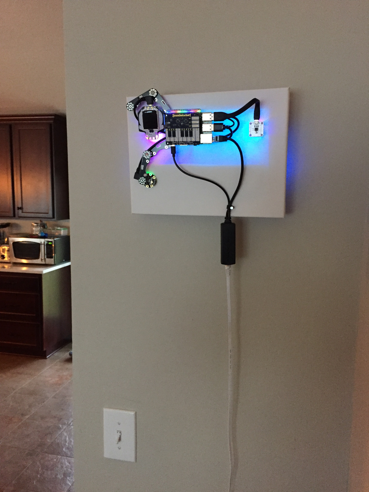

## CompuCanvas model SKTn3

#### tech specs

* Raspberry Pi 3B
* PoE injector: TRENDnet TPE-113GI; splitter: [Adafruit 3785](https://www.adafruit.com/product/3785)
* BlinkStick [Square](https://www.blinkstick.com/products/blinkstick-square)
* Pimoroni [LED shim](https://shop.pimoroni.com/products/led-shim)
* Pimoroni [piano hat](https://shop.pimoroni.com/products/piano-hat)
* Adafruit [HalloWing](https://www.adafruit.com/product/3900)
* Adafruit [NeoPixel strand](https://www.adafruit.com/product/3630) (behind canvas, connected to HalloWing)
* Adafruit [Gemma M0](https://www.adafruit.com/product/3501)
* USB speaker: Go Groove SonaVERSE USB

