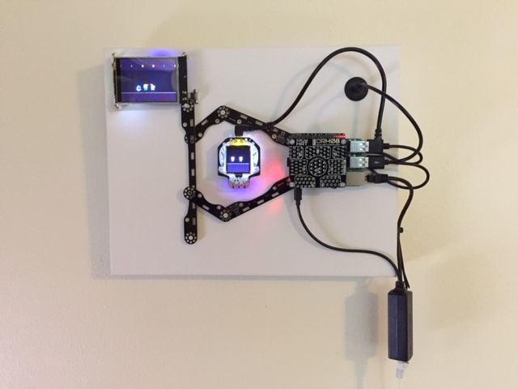

## CompuCanvas model SKTn4

#### tech specs

* Raspberry Pi 3B
* PoE injector: TRENDnet TPE-113GI; splitter: [Adafruit 3785](https://www.adafruit.com/product/3785)
* Pimoroni [LED shim](https://shop.pimoroni.com/products/led-shim)
* Pimoroni [drum hat](https://shop.pimoroni.com/products/drum-hat)
* Adafruit [PyPortal](https://www.adafruit.com/product/4116)
* Adafruit [HalloWing](https://www.adafruit.com/product/3900)
* Adafruit [CircuitPlaygroundExpress](https://www.adafruit.com/product/3333) (behind canvas)
* USB speaker (behind canvas)
